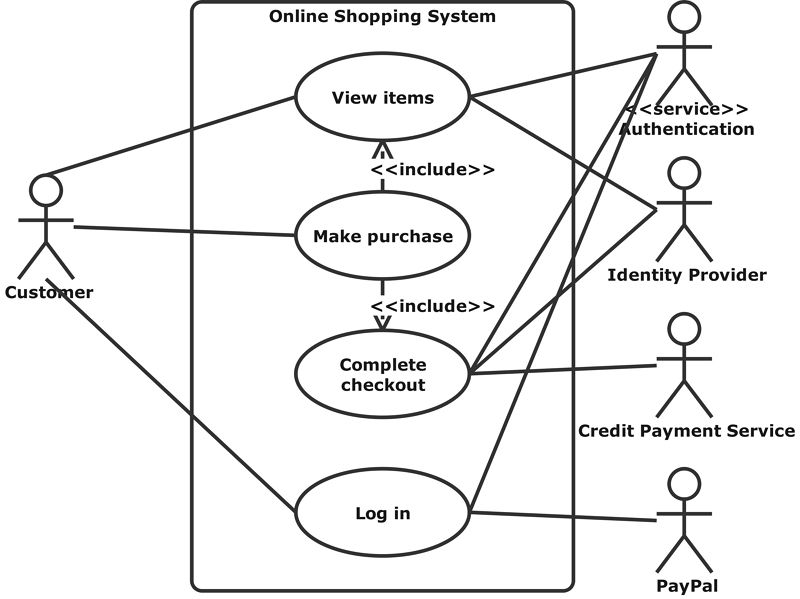

[Link README](https://jeffersondaviid.github.io/Programacion-II/)

<style>
@import url('https://fonts.cdnfonts.com/css/breakaway');
@import url('https://fonts.cdnfonts.com/css/citizen-dick');
@import url('https://fonts.cdnfonts.com/css/fearless-vampire-killer');

@import url('https://fonts.cdnfonts.com/css/godofwar');
@import url('https://fonts.cdnfonts.com/css/newton-howard-font');
@import url('https://fonts.cdnfonts.com/css/a-akhir-tahun');

* {
   box-sizing: border-box;
}
html,
body {
   background-color: #292c35 !important;
   color: #fff !important;
}
.title {
   font-family: GodOfWar;
   background: linear-gradient(#df1ffe, #42befc) !important;
   -webkit-background-clip: text !important;
   letter-spacing: 8px;
   color: transparent !important;
   margin-bottom: 0;

   /* font-size: 72px;
  background: -webkit-linear-gradient(#eee, #333);
  -webkit-text-fill-color: transparent; */
}

.tag {
   font-size: 23px;
   color: #ffa200;
   font-family: Lucida Handwriting;
   text-shadow: 3px 0 3px #000, 0 0 5px #ffa200, 0 0 10px #ffa200,
      0 0 20px #ffa200;
}

.autor {
   color: #00b4ff;
   font-size: 30px;
   font-family: Newton Howard Font;
   letter-spacing: 3px;
   text-shadow: 3px 2px 3px #000, 0 0 5px #00b4ff, 0 0 10px #00b4ff,
      0 0 20px #00b4ff;
}

.bimestre {
   background: linear-gradient(#42befc, #df1ffe) !important;
   font-family: GodOfWar, sans-serif;
   letter-spacing: 10px;
   -webkit-background-clip: text !important;
   color: transparent !important;
   margin-top: 0;
}

.container {
   position: relative;
}

.indicador {
   position: sticky;
   top: 0;
   right: 0;
   color: #f26;
   background-color: #292c35;
   font-size: 18px;
   font-weight: 500;
   z-index: 1;
}

.warning {
   border-left: 0.4rem solid !important;
   border-color: #f23 !important;
   border-top-left-radius: 25px;
   border-bottom-left-radius: 7px;
   background-color: #f231 !important;
   color: #fffc !important;
}

.sky {
   border-left: 0.4rem solid !important;
   border-color: #0ff !important;
   border-top-left-radius: 25px;
   border-bottom-left-radius: 7px;
   background-color: #0ff1 !important;
   color: #fffc !important;
}
.center {
   text-align: center;
}

.subtitulo {
   color: #0ff !important;
}

/* COLORES */

.morado {
   color: #f8f !important;
}

h3 {
   letter-spacing: 1.5px;
}

.menu-horizontal > li:hover {
   z-index: 100000;
}
.menu-vertical {
   position: absolute;
   display: none;
   list-style: none;
   width: 100%;
   background-color: #0ff1;
}

.menu-horizontal li:hover .menu-vertical {
   display: block;
   z-index: 100000;
}

pre {
   background-color: #3c3f49 !important;
   border: 2px solid #515663 !important;
   color: #fffd !important;
}

code {
   /* background-color: #f231 !important; */
   color: #ff9204dd !important;
}

em,
i {
   color: #00b4ff !important;
}

b,
strong {
   background-color: #ffa20088 !important;
}
</style>

<center>
<span class="title"> PROGRAMACION II </span><br>
<span class="tag"> < </span>
<span class="autor">JEFFERSON DAVID</span>
<span class="tag"> /> </span><br>
<span class="bimestre"> I BIMESTRE </span></center>

<p style="text-align:center;">
   <br>
   <audio controls autoplay src="otrosNoTocar\sonido.mp3" ></audio>
</p>


#  1. INTRODUCCION A LA PROGRAMACION, ARLGORITMOS Y DISEÑO
# SEMANA 1
## PREPARANDO NUESTRAS HERRAMIENTAS...
### IDE
Tiene que tener:
- Compilador
- proyectos
- editor

> Compilador

Java tiene un interprete para cada tipo de sistema: Windows, OS, Linux... hay que descargar el interprete para cada sistema operativo. Transforma el programa en `byte code` "ceros y unos".

### INSTALAR

- EXTENSION PACK FOR JAVA
- PROJECT MANAGER FOR JAVA
- TEST RUNNER FOR JAVA

### COMANDOS
 - CTRL + SHIFT : Multicursor lineal vertical

### GIT REPOSITORIO - ALL CODE

gh repo clone JeffersonDaviid/Programacion-II


## GIT 
### Estos son los comandos más utilizados en Git

- `git init`: Iniciar el control de versiones
- `git add .`: agrega todos los archivos al stage
- `git commit -m "mensaje"`: Mensaje clave del commit, ser puntual no detallado
- `git push`: envía los cambios a la nube
- `git status -s`: Ver estado de los archivos

### Comandos necesarios pero no muy utilizados en Git
- `git config --global user.name "mi nombre"`: nombre usuario global
- `git config --global user.email "myemail@example.com"`: email del git
- `git log --oneline`: lista de todos los commits descendentemente
- `git remote add origin "link que github nos da al momento de crear el repositorio"`
- `git push -u origin master/main`: aquí podemos elegir pero por temas políticos se elige main


---
---


# 😆SEMANA 2 

## CONOCIMIENTOS BASICOS
### Métodos 
- Retornan valor : `funcion`
- no retorna valor : `procedimiento` - metodos

### Structura Básica

<blockquote class="warning">Regla de Java:<br>El nombre del archivo debe ser EL MISMO que el nombre de la clase y tiene que ir en Mayusculas</blockquote><br>

##  CONTROL DE FLUJO 

Define el comportamiento de los datos.
  - if - else
  - for (n)
  - while(<>!=)
  - Do (<>!=)
  - switch


``` c
int a = 10;           // Tipo de dato entero
char nombre = "";     // Tipo de dato caracter

if (a == 10) {
    printf("el valor de a es 10");
  } else {
    printf("el valor de a no es 10");
  }
  return = 0;

  Funciones() <return>;   // Siempre retorna un valor
  Procedimiento();        // Solo realiza una acción pero no retorna una valor
```
## Tipo de datos
### Propios de Java
- String
- Integer
- Bool
- Int
- ...
#### Primitivos
- bool
- int
- ...

> Standart codif. : `camelCase`

## ALGORITMIA

<span class="morado"> EJEMPLO 2: </span> 

  1. **PROBLEMA**:    Determinar el mayor de 2 números
  2. **SOLUCIÓN**:    10, 30, 5

      __VARIABLES: a=10, b=30, c=5__

     1. **ALGORITMO** (pseudocódigo)  
              
          ``` H
		  Imprimir	"Ingrese el primer valor: "    
          Leer 		a    
          Imprimir 	"Ingrese el segundo valor: "   
          Leer 		b    
          Imprimir 	"Ingrese el tercer valor: "    
          Leer 		c    

          Si (a>=b) y (a>=c)    
            imprimir "el mayor valor es: " a  
            terminar  
          Si (b>=a) y (b>=c)    
            imprimir "el mayor valor es: " b    
            terminar
          Si (c>=a) y (c>=b)    
            imprimir "el mayor valor es: " c
            terminar
		  ```

      2. **DIAGRAMA DE FLUJO**   
            
          **Diagrama _con error_**

		  		
		  	
		  > Tiene un error porque el programa a pesar de que puede cumplirse una condicion, tiene que terminar, PERO aquí no, el programa EJECUTA TODAS LAS INSTRUCCIONES SIGUIENTES las cumpla o no.   
		  >
		  > Esto genera un CONSUMO DE RECURSOS INNECESARIOS		
            
          **Diagrama _sin error_**	

		  			
		  	
		  > Cuado se cumpla una condición entonces el programa termina con su ejecución
		  >	
		  > Esto NO genera un CONSUMO DE RECURSOS INNECESARIOS		


      3. **CODING**

		```
		// Aquí va el codigo
		```
		
      4. **TRACE**   

              


---
---

# 2. FUNDAMENTOS DE JAVA
## INTRODUCCION A JAVA 
Propiedad = `Ambito` + variable  
- Ambito: public, private, protect
  >Ejemplo:       
  ``` java
  public class XXXX{
     public Integer edadUsuario = 21; // propiedad
  }
  ```
<blockquote class="warning">Hay que tener MUCHO CUIDADO con el TIPO DE DATO, usar SABIAMENTE.</blockquote><br>

### VARIABLE VS PROPIEDAD

``` java
public class XXXX{
   public Integer edad = 21; // propiedad
   public static void main(){
      String nombreUsuario = "David"; // variable
      String nombre; // ? declaración
      nombre = "Jefferson" // ? inicialización
   }
}
```
### PARAMETROS

Argumentos de una función.
> `main (String variable){...codigo}`

```java
public class App {
   public static void main(String args[]) {
      System.out.println("Hola Mundo :)");
   }
}
```


## Bibliotecas
Aquí algunas de las librerias más usadas y básicas, librerias del propio lenguaje, NO LIBRERIAS EXTERNAS.

### Alagunos metodos más comunes

String : str
- `charAt(index)` // obtener un carácter   
- `Length` // obtener la longitud del string    
- `Equals` // comparación  
- `equalsIgnoreCase` // ignorar si es mayúsculas o minúscula      

Scanner : std

Scanner stdIn = new Scanner(System.in);      
< variable > = stdIn.nextLine();      
- `nextInt()` Se salta los espacios dejados en blanco hasta que encuentra un valor de tipo int     
- `nextLong()` Se salta los espacios dejados en blanco hasta que encuentra un valor de tipo long         
- `nextFloat()` Se salta los espacios dejados en blanco hasta que encuentra un valor de tipo float    
- `nextDouble()` Se salta los espacios dejados en blanco hasta que encuentra un valor de tipo double     


“salta los espacios dejados en blanco ”
- `next()` Se salta los espacios dejados en blanco hasta que encuentra un token. Devuelve el token como un valor tipo String.


### SCANNER

> import java.util.Scanner;     
> Scanner xxxx = new Scanner(System.in); // crear un objeto entrada     
> int valor = xxxx.nextInt(); // usar en numeros      
> string valor = xxxx.nextLine(); // usar en texto    

# 🙂SEMANA 3


## Creación de Métodos
### Métodos sin retorno de valor
```java
public void metodo(){
   // Instrucciones
}****
```

Detalles:
1. `public :` modificador de acceso
2. `void :` valor de retorno (puede ir int, string...) 
3. `metodo :` nombre del método
4. `... :` argumentos que recive el método

### Métodos con retorno
```java
public int metodo(int a, int b){
   return a + b;
}
```
```java
public float metodo(int a, float b){
   return a + b;
}
```
```java
public float metodo(float a, float b){
   return a + b;
}
```
<blockquote class="sky">Puede exitir funciones con el mismo nombre pero DEBEN SER DE DISTINTO TIPO DE PARAMETRO<br>En el ejemplo anterior tenemos 3 sumas</blockquote><br>


# 😶SEMANA 5

# PROGRAMACION ORIENTADA A OBJETOS

## HERENCIA

Permite la reutilizar código, es decir: Permite la creacion de clases apartir de otras ya existentes, heredando todas sus propiedades y métodos.

### NOMENCLATURA

Clase original   =  clase Padre  = Superclase      
Clase secundaria =  clase hijo   =  Subclase

## CONSTRUCTOR

Tiene que tener el mismo nombre de la clase;

> Para pasar la herencia a los hijos usamos `EXTENDS nombreClaseHijo`

Queremos heredar la clase `Hijo` apartir de la clase `Padre`.
```java
// ARCHIVO PADRE
public class Padre {
   public Padre(String nombre, String ocupacion, String sexo, int edad) {
      this.nombre = nombre;
      this.ocupacion = ocupacion;
      this.sexo = sexo;
      this.edad = edad;
   }
}
// ARCHIVO HIJO
public class Hijo extends Padre(String nombre, String ocupacion, String sexo, int edad){
   super(nombre, ocupacion, sexo, edad); // Super OBLIGATORIAMENTE debe ser la primera linea de codigo  cuando se requiere agregar. SI

   // aqui vas el codigo del Hijo
}
```


### CONSTRUCTOR CON PARAMETROS
```java
public Padre(String nombre, String ocupacion, String sexo, int edad) {
   this.nombre = nombre;
   this.ocupacion = ocupacion;
   this.sexo = sexo;
   this.edad = edad;
}
```
> `this` : Referenciar variables dentro del CONSTRUCTOR de las clase.

## DIAGRAMACION UML
### NOTACION PARA AMBITOS
- `+` public
- `-` private
- `~` paquete
- `#` protect
### NOTACION PARA METODOS
- `+` public
- `-` private

#### POO
- Mejorar el dieño
- Permite la reutilización
- Facilita la extensión
- Problema: acoplamiento


### OBJETOS
La 'variable' es el objeto que tiene referencia a la memoria RAM

```java 
Vehiculo v = new Vehiculo();
Coche c = new Coche();
Barco b = new Barco();
```

<blockquote class="warning">En la SUBCLASE <br>Antes de que se ejecute el constructor </blockquote><br>

### SOBRESCRIBIR METODOS DEL PADRE


# 😐SEMANA 6
 
### MODELADO O.O UML

- `→`  dirección del modelo

### COMPONENTES

- `uso` "____________" bidirección "-----→" linea de dirección     
- `inclusión`  "_ _ _ _ _ _ _ _" encima de la barra lleva _include_, es como para describir más el programa.
- `extension`  "-------→" encima de la barra lleva _extiende_, significa que depende de algo (más opciones para el usuario ejemplo un clienete puede pagar de diferenc).
- `Generalizaciones`  "-→" sirve para clasificar dato.


_exclude :_ va en dirección de la clase que la contiene, generalemente se usan entre caso de uso.   
_include :_ va en sentido de elemento opcional


### EJEMPLO DE DIGRAMA DE CLASES

Ejemplo de un biblioteca


### ELEMENTOS DE DIAGRAMA DE CASO DE USO


### EJEMPLO DE DIAGRAMA DE CASO DE USO

Comportamiento en cada elemento y su relación



# SEMANA 7


## ARQUITECTURA DE SOFTWARE (N-Tire)

 
###  Preguntas que se debe hacer 

- puede ser?
- debe ser?
- es?


## INTERFAZ

Si nos ponemos a pensar que cuando necesitamos una acción heredada de otra clase si o si debemos 

| Propiedad       | CLASES                                   | INTERFAZ                                                                         |
| --------------- | ---------------------------------------- | -------------------------------------------------------------------------------- |
| Propiedades     | SI                                       | NO                                                                               |
| Metodos         | Métodos concretos heredados del padre    | No tiene métodos concretos                                                       |
| Caracteristicas | Todos los hijos tiene los mismos metodos | Cada hijo hereda los métodos y PUEDE CONTROLAR el comportamiento de cada método. |
| UML             | SE EXTIENDE                              | SE IMPLEMENTA                                                                    |
<h3 class="center subtitulo"> ARQUITECTURA DE SOFTWARE </h3>

## Estructura de capas
### CAPAS
- PRESENTACION - GUI
- APLICACCIÓN - código
- DATOS - persistencia de datos

# NOTAS I BIMESTRE

## PROYECTO 3 Pt

Fecha: Miercoles
- _1pt: Prototipo_ : (Mockup/Figma/drawio) de todas las pantallas de aplicación
- _1pt Presentación_: Powepoint explicar 
- _1pt Demo_ : 20% o 30% de la app

## WORKSHOP 2 Pt


Jueves 12 de Enero de 2023

- Todas las clases documentadas.
- Exportar en PDF

## EXAMEN

Temas:   
- Todo hasta interfaces
- Interfaces graficas - Botones

<center>
<span class="title"> PROGRAMACION II </span><br>
<span class="tag"> < </span>
<span class="autor">JEFFERSON DAVID</span>
<span class="tag"> /> </span><br>
<span class="bimestre"> II BIMESTRE </span></center>


# CORRECCIÓN DE EXAMEN

## Interfaces:  

- Son l@s propiedades/métodos que vamos a exigir 

ejemplo:

| <center> << Interfaz >> |
| ----------------------- |
| + addAmigos() : void    |
| + addAmigosDe() : void  |
| + showAmigos() : void   |

```java 
public class  IActividad{

}
```

```java 
public class Persona extends Integrante implements IActividad{

}
```

# 😈 BASES DE DATOS con SQLITE

## PASOS PARA INICIAR BASE DE DATOS
0. Instalar extensión (VScode) SQLite
1. Crear directorio (DB)
2. Base de datos  `.db`
3. Crear dir/sqlScript
4. Shemma.sql -> 
  


RECURSOS
<blockquote class="warning">NotasImportantes </blockquote>
<blockquote class="sky">NotasImportantes</blockquote>
<h3 class="center subtitulo"> SUBTITUTLO🧠 </h3>
<span class="subtitulo">hola</span>

```python 

```